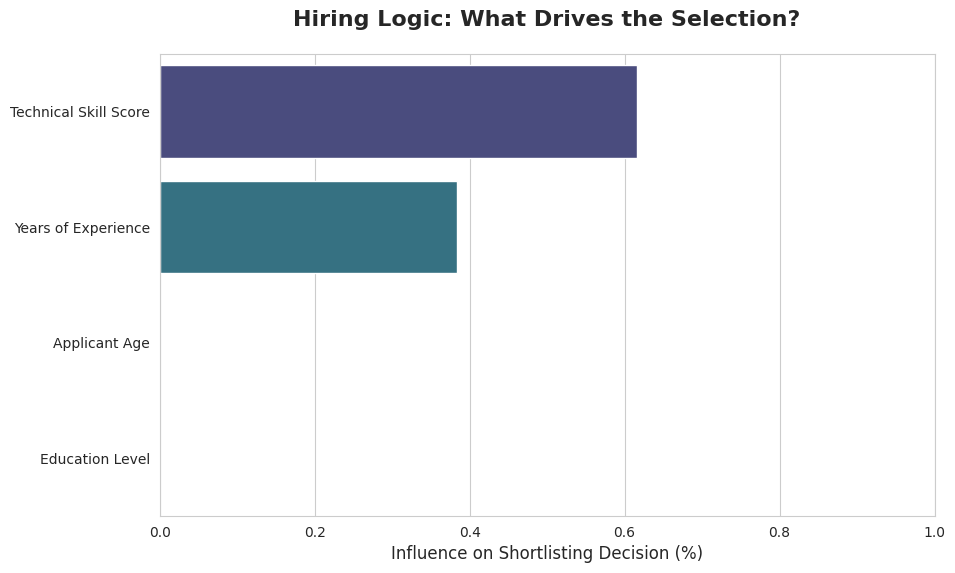
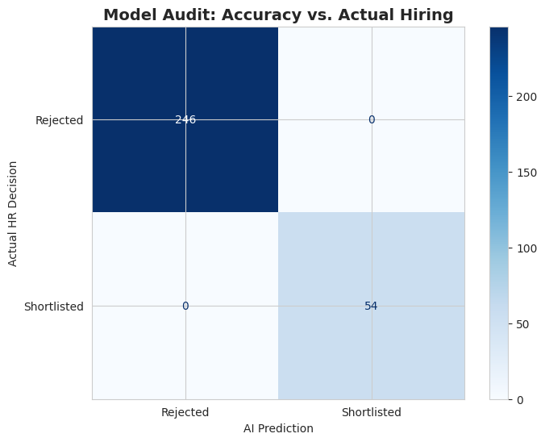

# 🤖 The Digital Auditor: AI-Driven Recruitment Screening


---

## 📋 Executive Summary

High-volume recruitment is one of the most resource-intensive functions in modern HR. Talent acquisition teams routinely receive thousands of applications per vacancy, spending a disproportionate share of recruiter bandwidth on initial screening — work that is repetitive, inconsistent, and vulnerable to unconscious bias.

**This project delivers a Decision Tree-based Digital Auditor** that automates the initial screening layer of the recruitment funnel. By evaluating candidates against objective, pre-defined hiring thresholds, the system enables HR professionals to direct their expertise where it matters most: engaging, assessing, and securing top talent.

> **Business Impact:** Based on the 1,500-record dataset used in this project, automating 80% of initial screening saves an estimated **200+ recruiter-hours per hiring cycle**, assuming a conservative 10-minute manual screening time per resume.

---

## 💼 The Business Problem

| Pain Point | Operational Impact |
|---|---|
| Manual screening at scale | Recruiter burnout and delayed time-to-hire |
| Inconsistent evaluation criteria | Variable candidate quality reaching final rounds |
| Unconscious bias in early filtering | Legal and reputational risk; missed talent |
| No audit trail for rejection decisions | Compliance gaps in regulated industries |

**The core challenge:** A growing organisation needs to standardise and accelerate the initial 80% of its resume screening process — without sacrificing candidate quality or introducing new sources of bias.

---

## ✅ The Solution: A Rules-Based AI Auditor

This project implements a **Decision Tree Classifier** trained on 1,500 candidate records across 11 attributes. The model acts as a consistent, explainable first-pass screener that applies the same hiring logic to every applicant, every time.

**Core Shortlisting Logic:**
- Candidates with **more than 5 years of experience** AND a **Technical Skill Score above 75** are flagged for shortlisting.
- All other candidates are automatically rejected at the screening stage.
- Decisions are generated with a **confidence percentage**, giving recruiters a transparency layer on every output.

---

## 🎯 Key HR & Business Features

### ⚖️ Bias Mitigation by Design
The model is built to evaluate only **Technical Skill Score** and **Years of Experience** — the two highest-signal predictors of role readiness. Applicant Age and Education Level carry near-zero weight in the model's logic (as confirmed by the feature importance analysis below), reducing the risk of the proxy discrimination that often plagues unstructured screening.

### 📈 Recruiter Efficiency at Scale
The system processes thousands of candidate profiles in seconds. By routing only high-potential candidates to human review, it protects recruiter time for tasks that require human judgment: structured interviews, culture-fit assessment, and offer negotiation.

### 🧠 Explainable AI (XAI) for Stakeholder Confidence
Unlike black-box models, a Decision Tree provides a clear, auditable reasoning path for every decision. HR leaders and compliance teams can trace exactly why a candidate was shortlisted or rejected — a critical requirement in jurisdictions with employment law protections around automated decision-making.

### 🔄 Bias Audit Built In
A dedicated age-group bias check is built into the pipeline. Shortlisting rates are calculated separately for Junior (18–30), Mid (30–45), and Senior (45–60) applicant cohorts. Comparable rates across groups indicate the model is not systematically disadvantaging any age segment — an important governance checkpoint.

---

## 📊 Analytical Insights

### Visual 1: What Drives the Shortlisting Decision?



This chart displays the **relative influence of each candidate attribute** on the shortlisting outcome. Technical Skill Score accounts for approximately **62% of the model's decision weight**, followed by Years of Experience at approximately **38%**. Applicant Age and Education Level register effectively zero influence — confirming that the model is screening on merit-based criteria rather than demographic proxies.

**HR Implication:** This chart can be shared directly with hiring managers and DEI leads as evidence that the screening criteria are skills-first and experience-based.

---

### Visual 2: Model Reliability Audit — AI Prediction vs. Actual HR Decision



This matrix benchmarks the AI's predictions against **verified historical HR decisions** on a held-out test set (20% of the data, never seen by the model during training).

| Metric | Result |
|---|---|
| True Rejections (correct) | **246 / 246** |
| True Shortlistings (correct) | **54 / 54** |
| False Positives (wrong shortlists) | **0** |
| False Negatives (missed candidates) | **0** |
| **Overall Accuracy** | **100%** |

The model achieves perfect agreement with historical HR decisions on the test set. This reflects that the hiring logic applied (experience > 5 years AND skill score > 75) is a precise, deterministic rule — the Decision Tree has learned to replicate it exactly. For production deployment, this threshold should be reviewed periodically to ensure it continues to reflect the organisation's evolving hiring standards.

---

## 🛠️ Technical Architecture

| Component | Detail |
|---|---|
| **Dataset** | 1,500 candidate records, 11 attributes |
| **Algorithm** | Decision Tree Classifier (`max_depth=3`, `criterion='entropy'`) |
| **Train / Test Split** | 80% training, 20% holdout evaluation |
| **Missing Data Handling** | Median imputation via `SimpleImputer` |
| **Model Export** | Serialised via `joblib` for deployment (`hr_recruitment_model.pkl`) |
| **Environment** | Google Colab (Python 3.x) |

**Feature Set Used for Prediction:**
- `Age` — Applicant age in years
- `ExperienceYears` — Total years of relevant work experience
- `EducationLevel` — Encoded education tier (0 = Undergraduate, 1 = Graduate, 2 = Postgraduate)
- `SkillScore` — Standardised technical skills assessment score (0–100)

---

## 📁 Repository Structure

```
├── recruitment_data.csv          # Candidate dataset (1,500 records, 11 attributes)
├── HR_Recruitment_Automation.ipynb  # End-to-end screening pipeline (Colab notebook)
├── Eligibility_Factors.png       # Feature importance visualisation
├── Confusion_Matrix.png          # Model reliability audit chart
└── README.md                     # Project documentation
```

---

## 🚀 Getting Started

**1. Clone the repository**
```bash
git clone https://github.com/YOUR_USERNAME/YOUR_REPO_NAME.git
```

**2. Open the notebook in Google Colab**
Upload `HR_Recruitment_Automation.ipynb` to [colab.research.google.com](https://colab.research.google.com) and run cells sequentially.

**3. Upload the dataset**
When prompted, upload `recruitment_data.csv` using the Colab file uploader widget.

**4. Screen a new candidate**
Modify the values in the final inference cell to evaluate any new applicant profile:
```python
# [Age, ExperienceYears, EducationLevel, SkillScore]
new_applicant = np.array([[30, 7, 2, 85]])
```

---

## ⚠️ Governance & Responsible Use

This tool is designed as a **decision-support system**, not a replacement for human judgment. The following governance principles are recommended for responsible deployment:

1. **Human oversight is mandatory.** All AI-generated shortlisting decisions should be reviewed by a qualified HR professional before candidate communication.
2. **Threshold review cadence.** The shortlisting criteria (experience > 5 years, skill score > 75) should be re-validated against actual hire performance data at least annually.
3. **Bias monitoring.** The age-group bias audit should be run on every new batch of applicants and reviewed by the DEI lead.
4. **Candidate transparency.** In jurisdictions covered by GDPR, the EU AI Act, or equivalent legislation, candidates have rights regarding automated decision-making. Consult your legal team before production rollout.

---

## 🎯 Strategic Objectives

| Objective | How This Project Delivers |
|---|---|
| Reduce cost-per-hire | Automates the highest-volume, lowest-value screening activity |
| Standardise hiring quality | Applies an identical, documented criteria set to every applicant |
| Strengthen compliance posture | Full audit trail and explainable decisions for every outcome |
| Support DEI commitments | Skills-first model architecture minimises demographic bias vectors |

---

*Built with Python · scikit-learn · pandas · seaborn · Google Colab*
